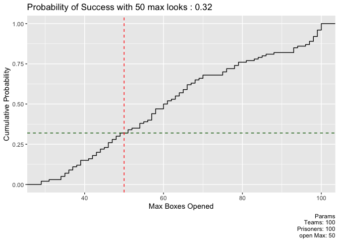
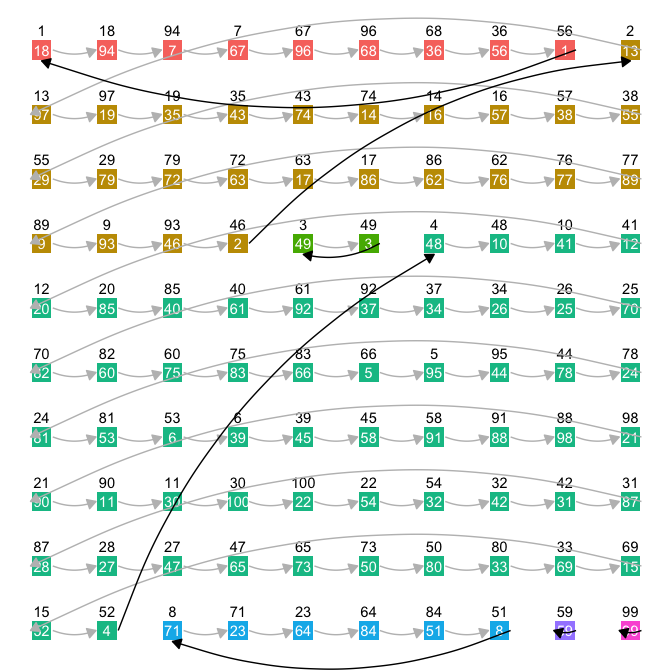

<!-- README.md is generated from README.Rmd. Please edit that file -->

# prisoners

<!-- badges: start -->

[](https://lifecycle.r-lib.org/articles/stages.html#experimental)
[](https://CRAN.R-project.org/package=prisoners)
<!-- badges: end -->

The goal of prisoners is to provide functinoality to simulate the 100
prisoners problem
(<https://en.wikipedia.org/wiki/100_prisoners_problem>) as stated below:

> The director of a prison offers 100 death row prisoners, who are
> numbered from 1 to 100, a last chance. A room contains a cupboard with
> 100 drawers. The director randomly puts one prisoner’s number in each
> closed drawer. The prisoners enter the room, one after another. Each
> prisoner may open and look into 50 drawers in any order. The drawers
> are closed again afterwards. If, during this search, every prisoner
> finds their number in one of the drawers, all prisoners are pardoned.
> If even one prisoner does not find their number, all prisoners die.
> Before the first prisoner enters the room, the prisoners may discuss
> strategy — but may not communicate once the first prisoner enters to
> look in the drawers. What is the prisoners’ best strategy?

Learn more about why I created this package at my blog post
[here](https://ndphillips.github.io/posts/the_prisoners.html).

## Installation

You can install the development version of prisoners from
[GitHub](https://github.com/) with:

``` r
# install.packages("devtools")
devtools::install_github("ndphillips/prisoners")
```

## Example

``` r
library(prisoners)
```

### Simulate Prisoner Games

Simulate multiple teams of prisoners using `prisoners_simulate()`.

Below, I’ll simulate a prisoner game with the following arguments:

- `teams_n = 100`: 100 teams of prisoners
- `prisoners_n = 100`: 100 prisoners in each team
- `open_max = 50`: 50 maximum number of boxes each prisoner can open

``` r
set.seed(12345)

# Simulate 100 teams of 100 prisoners using the 'agent' method
result <- prisoners_simulate(
  rooms = create_rooms(
    rooms_n = 100,
    prisoners_n = 100
  ),
  open_max = 50 # Maximum number of boxes each prisoner can open
)
```

``` r
# Print the result
result
#> Prisoner Game
#> Teams: 100
#> Prisoners: 100
#> Simulation Completed?: TRUE
```

Access key results using `pull_*()` functions:

``` r
# What were the key outcomes for each team?
pull_outcomes(result)
#> # A tibble: 100 × 2
#>    is_success boxes_opened_n_max
#>    <lgl>                   <dbl>
#>  1 FALSE                      66
#>  2 FALSE                      76
#>  3 TRUE                       39
#>  4 FALSE                     100
#>  5 FALSE                      51
#>  6 FALSE                      98
#>  7 FALSE                      57
#>  8 FALSE                      70
#>  9 TRUE                       41
#> 10 TRUE                       29
#> # ℹ 90 more rows

# What was the overall success rate?
pull_success_p(result)
#> [1] 0.32

# How long did the simulation take?
pull_duration_mean(result)
#> [1] 0.9777723
```

Visualise the results using `plot_*()` functions:

``` r
plot_boxes_max(result)
```



### Other Functions

You can create your own rooms using `create_rooms()` and then access
individual rooms with `pull_room()`

``` r
# Create 10 rooms of 100 boxes
rooms <- create_rooms(
  rooms_n = 10,
  prisoners_n = 100
)

# Pull out the first room
room_1 <- rooms |> 
  pull_room(1)

room_1
#> # A tibble: 100 × 2
#>      box ticket
#>    <int>  <int>
#>  1     1     18
#>  2     2     13
#>  3     3     49
#>  4     4     48
#>  5     5     95
#>  6     6     39
#>  7     7     67
#>  8     8     71
#>  9     9     93
#> 10    10     41
#> # ℹ 90 more rows
```

Given a room, you can add columns indicating loops using
`add_loops_to_room()`

``` r
# Add loops to the room
room_1 <- room_1 |>
  add_loops_to_room()

room_1
#> # A tibble: 100 × 4
#>      box ticket  loop index_in_loop
#>    <int>  <int> <dbl>         <dbl>
#>  1     1     18     1             1
#>  2     2     13     2             1
#>  3     3     49     3             1
#>  4     4     48     4             1
#>  5     5     95     4            21
#>  6     6     39     4            28
#>  7     7     67     1             4
#>  8     8     71     5             1
#>  9     9     93     2            23
#> 10    10     41     4             3
#> # ℹ 90 more rows
```

You can vizualize a room using `plot_room()` (Use `show_loops = FALSE`
to show the room without organizing by loops)

``` r
# Vizualize a room
room_1 |>
  plot_room()
```


